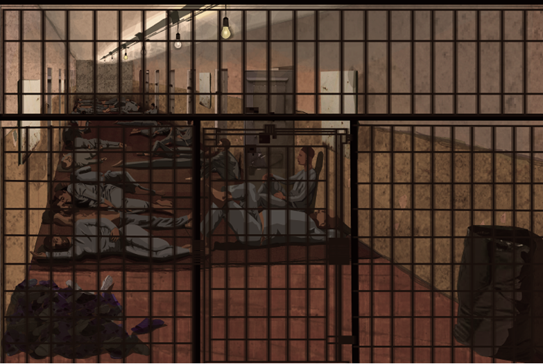
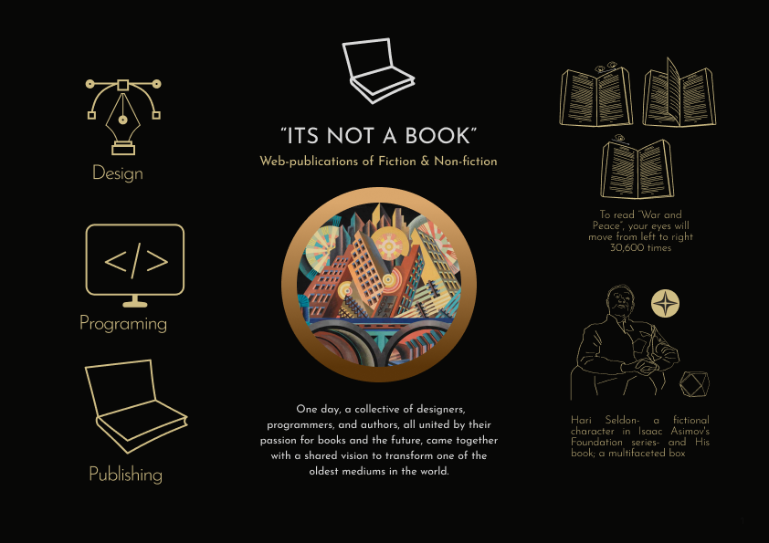
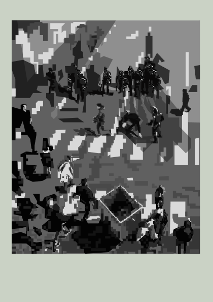

# The Troubles of Butterflies

## How did I even end up getting into programming at 36?

I'm 38 years old, and I started programming less than two years ago. A couple of days ago, while struggling — quite desperately, and with some help from AI — to organize a game project I had just finished in a GitHub repository, I became frustrated enough that, for a moment, I suddenly asked myself: "How did I even end up getting into programming at 36? Am I not a little too old to be learning new things?"

The thing is that ever since I was a child, I've always been pretty good at starting new things, while sticking with my thoughts, interests, and activities has always been difficult for me. I have experienced this moment many times: finding myself in the middle of learning something while no longer being sure why I started it in the first place.

My older sister has told this story about me countless times, in all kinds of gatherings, and I recently realized that it might actually be a good introduction to who I am. My sisters are six years older than me — they are identical twins. Once, when I was seven or eight, they sent me out at ten in the morning to buy knitting needles. Apparently, they had to knit something for one of their classes that afternoon. When I still hadn't come home after a long time, they started to worry, so they went out to look for me. After searching for quite a while, they found me at the end of an alley, chasing butterflies with the knitting needles. I had completely forgotten that I was supposed to go home.

If I'm being honest, starting programming at 36 was, in a way, like chasing butterflies. To answer that question, I need to figure out what really brought me here in the first place. Remembering why I started helps me resist my urge to move on, overcome the difficulties of the path I'm on, and keep going.

Writing and visual art (drawing, painting, and animation) have been part of my life in one form or another for most of these years. Making visual art was both a serious hobby and a kind of dopamine hit for me. Having a talent for drawing, painting, and animation was seen as a kind of gift, almost a divine one. On the other hand, writing was a difficult and exhausting activity, and in the circles I was part of at the time, it wasn't a particularly popular choice either. Eventually, in my early twenties, I chose the latter.

But apparently, most writers also had another profession or area of expertise. Chekhov and Gholam-Hossein Saedi were doctors. Roger Martin du Gard trained as an archivist. Kafka and John Grisham studied law. Maybe Nabokov was the only one who had no profession other than writing and chasing butterflies.

Later, I realized that the problem wasn't simply that writing wasn't recognized as a profession. There was a more important contradiction: while reading a novel takes the reader out of this boring world and into another one, almost all novels nevertheless describe this very same boring world. So writing requires a constant engagement with and understanding of the outside world.

For almost fifteen years, I made a living writing essays for magazines and newspapers and working in different areas of journalism. I kept writing, but alongside it there was always a second "real job," changing from year to year. Screen printing, animation, sales, PR, graphic design and brand development, management, and so on — all of these activities were attempts to keep writing and to keep moving forward as a writer.

But writing was an absolute failure. Eventually, at 27, for the first time I felt that I was writing something I could work on for a long time without eventually coming to hate it. I continued working on my novel for about four years and named it *The Seventh Continent*. I would read parts of it to my friends, and for the first time I began to believe in myself as a writer.

And that's where the story really began: I didn't want to publish my novel in the conventional way — with censorship and the official label of Iran's Ministry of Culture and Islamic Guidance. At the time, someone gave me the idea of publishing it independently on the internet.

Publishing a novel online wasn't exactly a strange idea, although it wasn't particularly common either. But the problem was that books published online were, at best, PDF files. Nothing more. Meanwhile, the web was full of incredible possibilities, most of which were being used by businesses. I thought this was an extraordinary opportunity to change the form of the book — that a book could only really belong on the internet if it broke out of its traditional form. I couldn't get this idea out of my head.

I decided to rewrite my novel with this in mind and try to present it in a different form. Since my technical knowledge was extremely limited, I made my first UI prototype in PowerPoint.

When the COVID pandemic began, I finally had the opportunity to take an introductory Python course on [Coursera](https://www.coursera.org/). It wasn't easy; it ultimately ended in failure. I thought I simply couldn't do it. But I kept designing.

My next opportunity to return to programming came after I was arrested in the summer of 2021. I was arrested on charges of "collusion against national and international security", "propaganda against the Islamic Republic of Iran", and "insulting the Supreme Leader". I spent nearly a month in prison, and the only thing that could make time pass was thinking about how I could publish a book on the internet. I called it *It Is Not a Book*. In my mind, I started designing its logo, thinking through its goals and mission, and imagining countless details.

After I was released, it took about nine months to get my laptop and other devices back. During that time, I used a laptop that belonged to one of my programmer friends. [Figma](https://www.figma.com/) was installed on it. I started designing and recreating the UIs of different websites. At some point, I realized that I had actually become deeply involved in learning JavaScript and CSS.

Now, it has been less than two years since I started learning programming languages, and about three years since I first discovered Figma. I realized that although I was never a professional animator, my visual art background combined with code allowed me to make things that were different and creative. The same is true of my other experiences.

Even though I still haven't published *The Seventh Continent* — and I've also started other parallel projects — the idea of publishing books independently on the internet changed my direction. And sometimes, like now, when I become frustrated and tired, I have to go back and remind myself how I ended up here in the first place.

For years, I tried to hide this pattern, treating it as a weakness — proof that I couldn't commit, specialize, or stay in one direction. But eventually I found the actual reason, and it isn't a flaw I'm managing. I've realized that I have a fundamental problem with specializing in just one field.

What I want is to be an amateur — in the original sense of the word, from the French *amour*: someone who does the work because they love it. Professionalism, on the other hand, implies a certain external way of measuring your life, a constant drive to move ahead — something you probably can't completely escape, but can certainly resist to some extent.

So at a certain point, I decided to stop apologizing for it.

I am an amateur, unschooled and proud of it — chasing butterflies, on purpose, this time.
